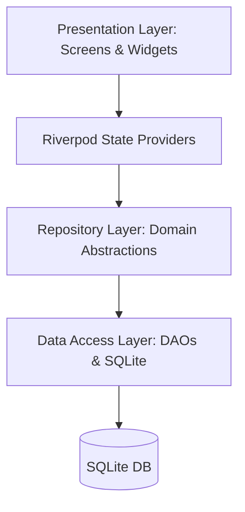

# Architecture Overview

OrderKart uses a clean, layered architecture leveraging Flutter and Riverpod.

## Layer Structure

### 1. Presentation Layer (`lib/features/*/presentation/`)
- Screens, custom widgets, state providers.
- Highly consistent Apple-style glassmorphism using `GlassContainer` and `AppScaffold` with custom radial gradient circles.

### 2. Domain Layer (`lib/features/*/domain/`)
- Immutable model classes representing entities (e.g. `Customer`, `Order`, `Item`, `Location`, `Worker`).

### 3. Data Layer (`lib/features/*/data/`)
- **DAOs**: Data Access Objects containing raw SQLite queries and inserts.
- **Repositories**: Standard interfaces mapping domain queries to database calls.

### 4. Shared Core Services (`lib/core/services/`)
- **HotspotSyncService**: High-speed P2P hotspot sync socket server & client.
- **WorkerPackageService**: Provisioning package compilation and scope checking.
- **DatabaseHelper**: Singletone database manager containing schema initialization and migrations.
