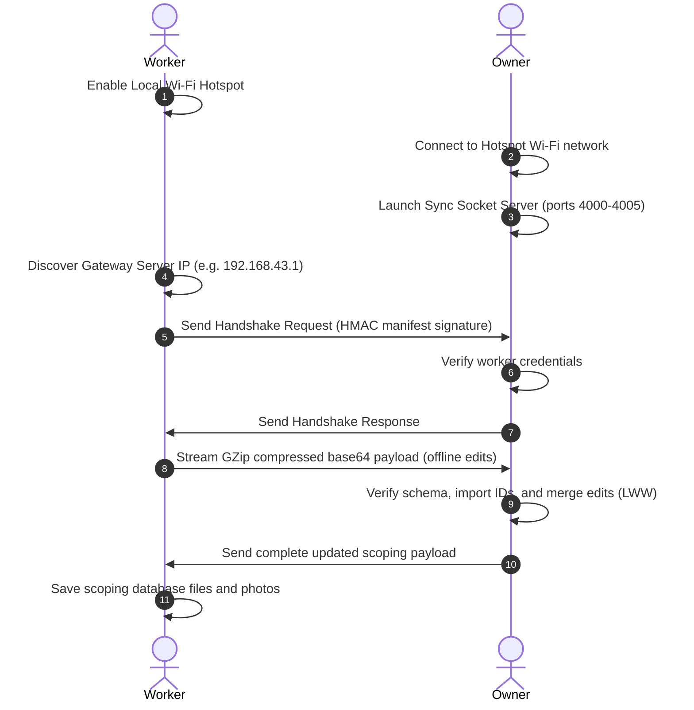

# Core System Workflows

Detailed sequence flow, serialization formats, and mathematical rules of complex multi-step processes inside the OrderKart application.

## 1. Local P2P Hotspot Sync Lifecycle & Serialization

This allows workers to synchronize their sales directly with the owner without an internet connection:

### Sequence Flow

### Serialization Protocol
- The sync packet is sent as a raw HTTP POST containing a JSON body:
  - Header data maps the schema version, minimum app version, package IDs, and source identifiers.
  - The database tables payload is serialized to a JSON Map, compressed using **GZip**, and encoded into a **Base64Url** string stored inside the `'data'` field of the outer JSON envelope.
  - This drastically reduces Wi-Fi handshake times and memory overhead during transmission.

---

## 2. Smart Rounding Mathematical Rules

To make cash checkouts fast and clear, the app uses a custom `SmartRounding` utility:

1. **Truncation**: Truncate the amount to its integer part (`intPart = amount.truncate()`).
2. **Modulo**: Find the units digit (`units = intPart % 10`).
3. **Assertion**:
   - If the last digit is `0` or `5`, return the original rounded integer (no rounding necessary).
   - If the last digit is `< 5`, round UP to the next multiple of 5:
     $$\text{Rounded} = \text{intPart} - \text{units} + 5$$
   - If the last digit is `> 5`, round UP to the next multiple of 10:
     $$\text{Rounded} = \text{intPart} - \text{units} + 10$$
4. **Centennial Snap**:
   - Calculate the next round hundred amount:
     $$\text{nextHundred} = \left(\lfloor \text{intPart} / 100 \rfloor + 1\right) \times 100$$
   - If the difference between `nextHundred` and the current amount is $\le 5$, snap the grand total to `nextHundred`.

---

## 3. Dynamic Checkout & Question Flow

Owners can configure custom questions that workers must fill out when creating orders:

1. **Definition**: The Owner creates a question under `order_questions` (e.g. "Ask if customer has feedback" with options: Yes, No).
2. **Assertion**: In the checkout flow (`create_order_screen.dart`), the app reads active questions.
3. **User Entry**: The worker must select options for all required questions.
4. **Storage**: Responses are recorded in `order_question_answers` and mapped to `orders.id` for synchronization and analysis.

---

## 4. GIS Boundary drawing & Editor Flow

Assign custom polygons to area intelligence sectors:

1. **Creation**: Select location from hierarchy screen.
2. **Editor**: Open `BoundaryEditorWidget`. Tap on map to lay polygon vertices.
3. **Calculations**: Points are checked for valid loops and stored in `geo_boundary_points` linked to `geo_boundaries`.
4. **Scoping**: When map is loaded, boundary regions filter customer marker lists.

---

## 5. Periodic Local Alert Reminders

To maintain driver efficiency without cloud-based background workers, the app schedules local notifications:
* **Timer Trigger**: A repeating task scheduled using local timezone assets (`timezone/data/latest_all.dart`) via `FlutterLocalNotificationsPlugin`.
* **Execution Interval**: Fires exactly every **5 hours** (`periodicId = 8888`) with the message:
  *"Time to check your pending deliveries, stock levels, and client dues!"*
* **Low-Power Wakeup**: Configured with `exactAllowWhileIdle = true` to force wakeups and prompt workers to reconcile pending cash collection sheets and visit schedules even in sleep states.

---

## 6. Business UPI QR Code Billing Flow

To facilitate cashless collection directly in the field:
* **Configuration**:
  - The Owner configures either a raw UPI payload string (`upi://pay?pa=...` stored in `qrContent`) or uploads a custom static QR image (`qrCustomImage`).
* **Generation**:
  - When configuring raw UPI text, the app dynamically renders a vector QR code image in the UI using `QrImageView` (`qr_flutter`).
* **Provisioning & Scoping**:
  - During worker provisioning exports, the static QR code image is cloned to the `qr_codes/qr_custom_image` destination within the `.orderkart` ZIP container.
* **On-Site Collection**:
  - The worker displays the screen to the customer at the checkout door. The customer scans the QR code to complete the payment via any mobile banking app.

---

## 7. External Messaging & Navigation Launchers

To coordinate field deliveries:
* **WhatsApp Messages native-to-web fallbacks**:
  - Strips non-digit chars.
  - If a 10-digit number is passed, it automatically prepends standard country code `'91'`.
  - Attempts launching native scheme (`whatsapp://send?phone=...`) first.
  - If native app launch fails, redirects to web scheme (`https://wa.me/...`).
  - If web launcher fails, invokes the system native sharing sheet (`Share.share`) to avoid losing text payload.
* **GPS Coordinate launch**:
  - Checks coords for standard `latitude,longitude` formats.
  - Launches navigation route overlays directly using `google.navigation:q=...`.
